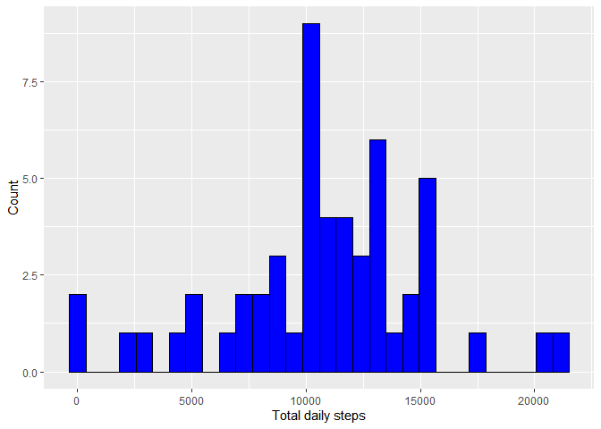
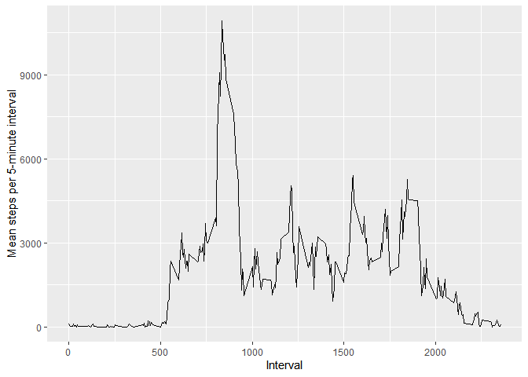
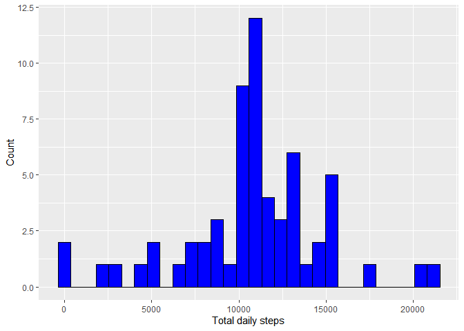
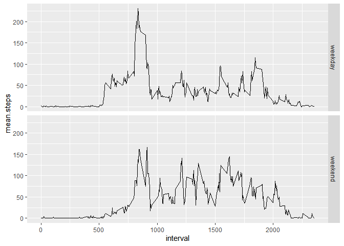

## Loading required packages

```r
library(tidyverse)
```

```
## ── Attaching core tidyverse packages ──────────────────────── tidyverse 2.0.0 ──
## ✔ dplyr     1.1.4     ✔ readr     2.1.4
## ✔ forcats   1.0.0     ✔ stringr   1.5.1
## ✔ ggplot2   3.5.0     ✔ tibble    3.2.1
## ✔ lubridate 1.9.3     ✔ tidyr     1.3.1
## ✔ purrr     1.0.2     
## ── Conflicts ────────────────────────────────────────── tidyverse_conflicts() ──
## ✖ dplyr::filter() masks stats::filter()
## ✖ dplyr::lag()    masks stats::lag()
## ℹ Use the conflicted package (<http://conflicted.r-lib.org/>) to force all conflicts to become errors
```

```r
library(xtable)
```

## Loading and preprocessing the data


Loading the data

```r
activity.data<-read_csv("activity.csv")
```

```
## Rows: 17568 Columns: 3
## ── Column specification ────────────────────────────────────────────────────────
## Delimiter: ","
## dbl  (2): steps, interval
## date (1): date
## 
## ℹ Use `spec()` to retrieve the full column specification for this data.
## ℹ Specify the column types or set `show_col_types = FALSE` to quiet this message.
```

## What is mean total number of steps taken per day?

Calculate total steps per day


```r
total.daily.steps<-activity.data %>%
  group_by(date)%>%
  summarize(sum.daily.steps=sum(steps)) %>%
  drop_na()
```

Histogram of the total number of steps taken each day

```r
ggplot(data=total.daily.steps, aes(x=sum.daily.steps))+
  geom_histogram(fill='blue', color='black')+
    xlab('Total daily steps')+
    ylab('Count')
```

```
## `stat_bin()` using `bins = 30`. Pick better value with `binwidth`.
```

<!-- -->

Mean and median of the total number of steps taken per day


```r
daily.steps.summary.stats<-total.daily.steps %>%
  ungroup() %>%
  summarize(mean.daily.step=mean(sum.daily.steps, na.rm=TRUE), 
            median.daily.steps=median(sum.daily.steps, na.rm=TRUE))%>%
  rename(Mean_Daily_Steps=mean.daily.step,
         Median_Daily_Steps=median.daily.steps)

ds.xt<-xtable(daily.steps.summary.stats)

print(ds.xt, type='html')
```

<!-- html table generated in R 4.3.2 by xtable 1.8-4 package -->
<!-- Tue Feb 27 10:08:56 2024 -->
<table border=1>
<tr> <th>  </th> <th> Mean_Daily_Steps </th> <th> Median_Daily_Steps </th>  </tr>
  <tr> <td align="right"> 1 </td> <td align="right"> 10766.19 </td> <td align="right"> 10765.00 </td> </tr>
   </table>


## What is the average daily activity pattern?

Average number of steps taken per 5 minute interval:


```r
mean.interval.steps<-activity.data %>%
  group_by(interval)%>%
  summarize(mean.interval.steps=sum(steps, na.rm=TRUE)) 
```


```r
(ggplot(data=mean.interval.steps, aes(x=interval, y=mean.interval.steps))+
    geom_line()+
    ylab('Mean steps per 5-minute interval')+
    xlab('Interval'))
```

<!-- -->

Interval with the maximum mean steps:


```r
max.steps<-mean.interval.steps %>%
  filter(mean.interval.steps==max(mean.interval.steps)) %>%
  dplyr::select(interval)

print(xtable(max.steps), type='html')
```

<!-- html table generated in R 4.3.2 by xtable 1.8-4 package -->
<!-- Tue Feb 27 10:08:56 2024 -->
<table border=1>
<tr> <th>  </th> <th> interval </th>  </tr>
  <tr> <td align="right"> 1 </td> <td align="right"> 835.00 </td> </tr>
   </table>


## Imputing missing values

Rows with missing data:


```r
        missing.data.rows<-activity.data %>%
          mutate(missing=is.na(steps)) %>%
          filter(missing==TRUE) %>%
          nrow()
        
        print(missing.data.rows)
```

```
## [1] 2304
```


Histogram of imputed total daily steps

```r
imputed.data<-data.frame()

interval.list<-unique(activity.data$interval)

for (i in interval.list){
  
      to.impute<-activity.data %>%
        filter(interval==i) 
      
      to.impute$steps[is.na(to.impute$steps)]<-mean(to.impute$steps, na.rm=TRUE)
      
      imputed.data<-bind_rows(imputed.data, to.impute)

}

imputed.activity.data<-imputed.data %>%
  group_by(date) %>%
  summarize(sum.daily.steps=sum(steps))

ggplot(data=imputed.activity.data, aes(x=sum.daily.steps))+
    geom_histogram(fill='blue', color='black')+
    xlab('Total daily steps')+
    ylab('Count')
```

```
## `stat_bin()` using `bins = 30`. Pick better value with `binwidth`.
```

<!-- -->

Imputed mean and median daily steps


```r
daily.steps.summary.stats<-imputed.activity.data %>%
    ungroup() %>%
    summarize(mean.daily.step=mean(sum.daily.steps, na.rm=TRUE), 
              median.daily.steps=median(sum.daily.steps, na.rm=TRUE))

ds.xt.im<-xtable::xtable(daily.steps.summary.stats)

print(ds.xt.im, type='html')
```

<!-- html table generated in R 4.3.2 by xtable 1.8-4 package -->
<!-- Tue Feb 27 10:08:57 2024 -->
<table border=1>
<tr> <th>  </th> <th> mean.daily.step </th> <th> median.daily.steps </th>  </tr>
  <tr> <td align="right"> 1 </td> <td align="right"> 10766.19 </td> <td align="right"> 10766.19 </td> </tr>
   </table>

The imputed mean is unaffected, but the median is now slightly higher


## Are there differences in activity patterns between weekdays and weekends?


```r
week.part<-imputed.data %>%
  mutate(day.type=as.factor(ifelse(weekdays(date)=='Sunday' | 
                                     weekdays(date)=='Saturday', 'weekend', 'weekday'))) %>%
  group_by(day.type, interval) %>%
  mutate(mean.steps=mean(steps))
```

Mean number of steps in a given 5-minute interval by weekday-day or weekend-day


```r
(ggplot(data=week.part, aes(x=interval, y=mean.steps))+
  geom_line()+
  facet_grid(day.type~.))
```

<!-- -->


